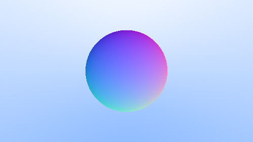
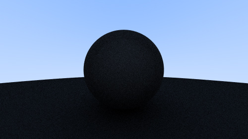
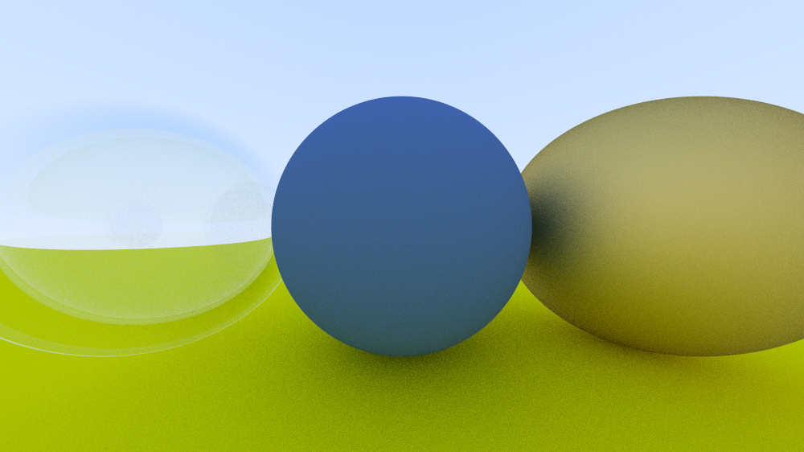
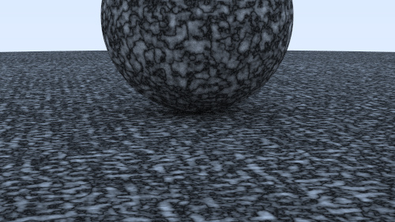

Ray tracer in a weekend.

Resources :
* https://raytracing.github.io
* https://github.com/nothings/stb

# [Ray Tracing In One Weekend](https://raytracing.github.io/books/RayTracingInOneWeekend.html)

## Initial gradient based background

## Sphere with flat color

## Sphere with normals visualized

## Sphere with normals visualized with ground

## Sphere with normals with antialiazing

## Apply Diffuse Material

## Gamma Correction

## True Lambertian Refleaction

## A Scene with Metal Spheres

## Add Fuzzy Reflection

## Refraction and Snell's Law

## Total internal reflection

## Hollow Glass sphere

## Add Camera with Positioning

## Add Defocus Blur/ Depth of Field effect

## A Final Render

# [Ray Tracing The Next Week](https://raytracing.github.io/books/RayTracingTheNextWeek.html)

## Moving Spheres / Motion Blur

## Texture / Checker texture

## Texture / Perlin Noise

## Texture / Perlin Noise / With Trilinear interpolation

## Texture / Perlin Noise / Scaled

## Texture / Perlin Noise / Shifted

## Texture / Perlin Noise / Turbulence

## Texture / Perlin Noise / Marbles

## Texture / Image Texture / Earth

## Light

